# 
玩转iOS开发：《iOS设计模式 — 简单工厂与抽象工厂》</p****>

---
### 目录
- [作者感言](#作者感言)
- [简介](#简介)
- [简单工厂与抽象工厂](#简单工厂与抽象工厂)
- [简单工厂](#简单工厂)
- [抽象工厂](#抽象工厂)
- [新建抽象工厂目录](#新建抽象工厂目录)
- [完善对应的工厂](#完善对应的工厂)
- [工厂管理者](#工厂管理者)
- [使用抽象工厂](#使用抽象工厂)
- [工程地址](#工程地址)

---
### 作者感言

> 刚忙完就给我来一场大病, 多么痛的领悟, 好不容易好点了, 可以整理整理知识点了~
> 
> 最后:
> 如果你有更好的建议或者对这篇文章有不满的地方, 请联系我, 我会参考你们的意见再进行修改, 联系我时, 请备注**`工厂模式`**, 如果觉得好的话, 希望大家也可以打赏一下~嘻嘻~祝大家学习愉快~谢谢~

Cain(罗家辉)

zhebushimengfei@qq.com: 联系方式

350116542: 腾讯QQ

---
### 简介

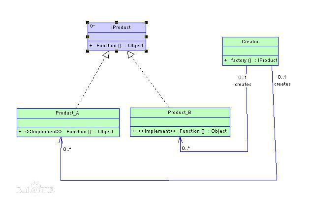

> 所谓**`工厂模式`**其实显示中的工厂没啥区别, 客户下单, 工厂负责做出产品出来交货, 这样子就没了, 至于工厂里面做了什么东西, 怎么实现, 我们完全不用关注, 只要知道工厂能按时交货就可以了.

---
### 简单工厂与抽象工厂
> 在工厂模式当中, 又有两种不同的工厂模式, 分别是**`简单工厂`**与**`抽象工厂`**, 他们之前的区别也很简单, 无非就是一个是**`实例`**一个**`抽象`**, 这么说好像不太明确, 下面我们来建个工程, 看看**`简单工厂`**和**`抽象工厂`**两者之间到底有啥不一样~

---
### 简单工厂

> 首先我们把之前的那个**`WorkSpace`**打开, 新建一个**`FactoryPattern`**工程, 然后我们再来新建一个工厂类, 这次我们就拿一个汽车工厂作为例子~

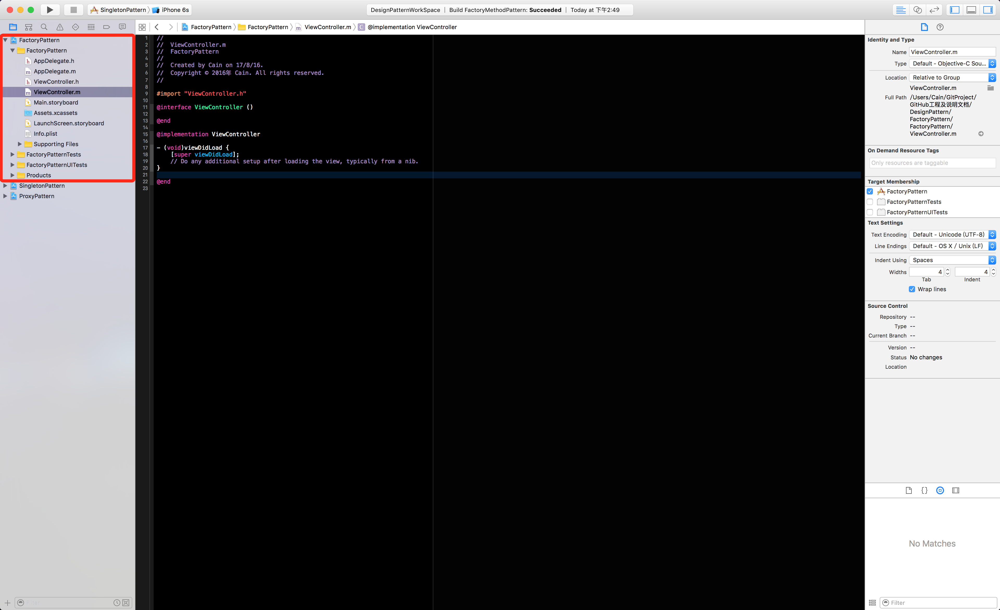

> 接下来我们创建一个汽车的基类**`BaseCar`**, 还有一个协议, 这个协议是用来限制**`BaseCar`**或者**`BaseCar`**的子类实现一些必须实现的方法, 我这里只是做演示, 所以**`BaseCar`**类里面空实现就好了, 其他的交给子类去实现.

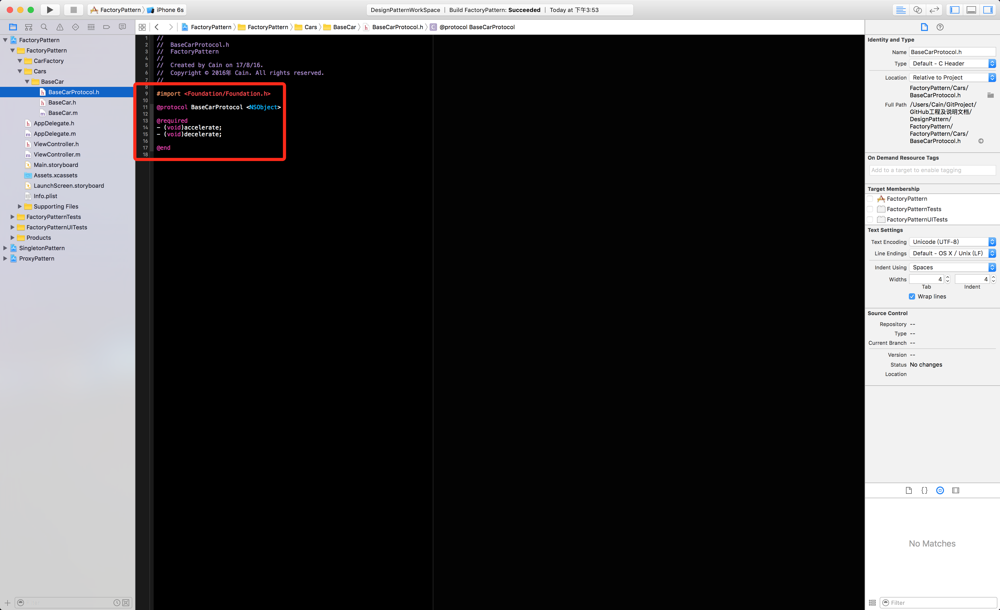
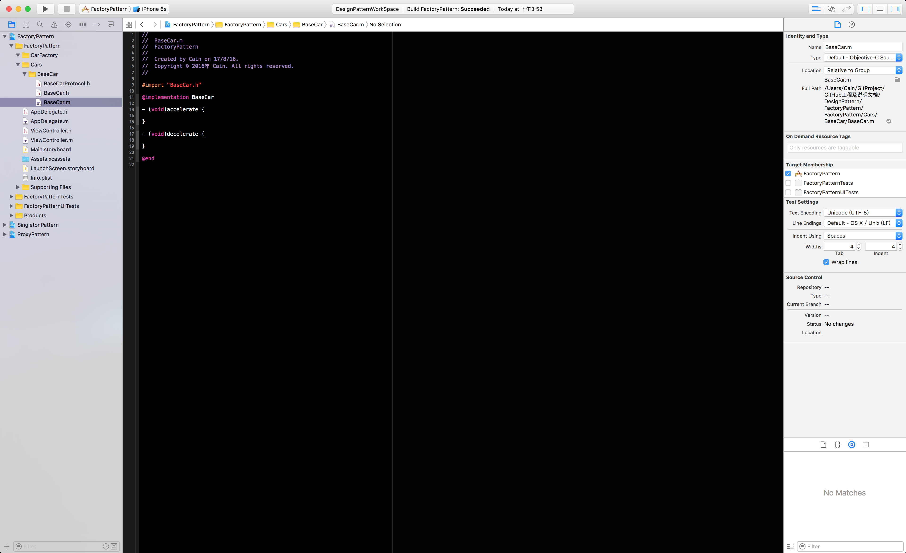

> 汽车的基类我们已经有了, 现在我们来建立一个汽车工厂类, 就拿全球最大的汽车厂商通用来做例子, 在这里我们会拿通用汽车的几个旗下品牌来做例子, 且都继承与**`BaseCar`**, 然后给他们对应做一些差异化的操作就OK了~~

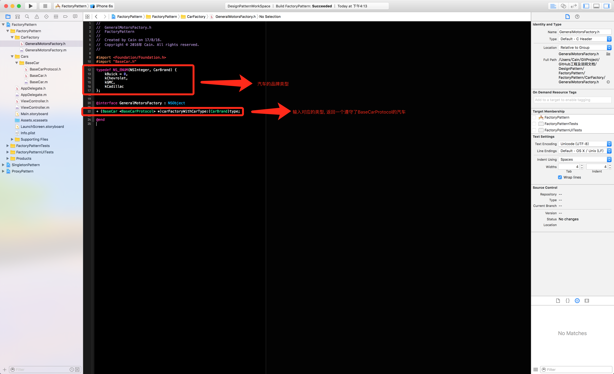
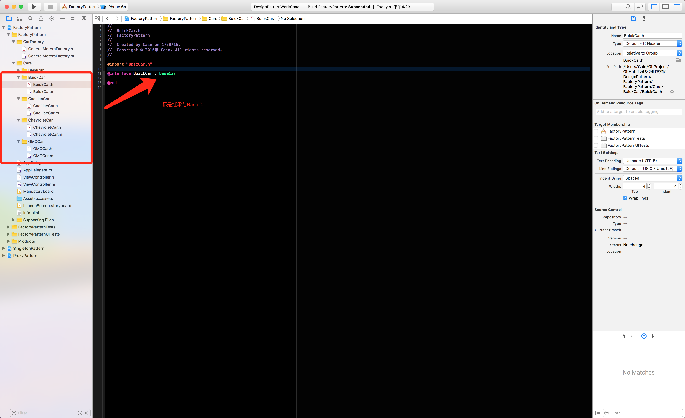

> 现在我们来实现**`Protocol`**里的方法再加一些差异化, 酱紫我们就知道到时候初始化出来的汽车是哪辆了~~
> 我们先拿**`Buick`**来做例子, 添加一个差异化方法, 然后再看看我们利用工厂模式初始化出来的对象是不是**`Buick`**.

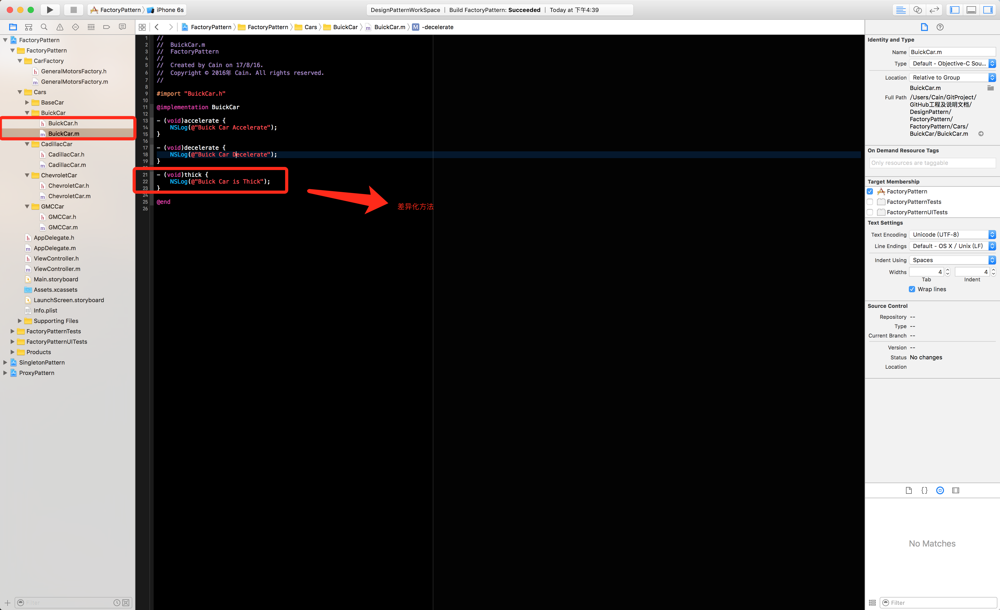
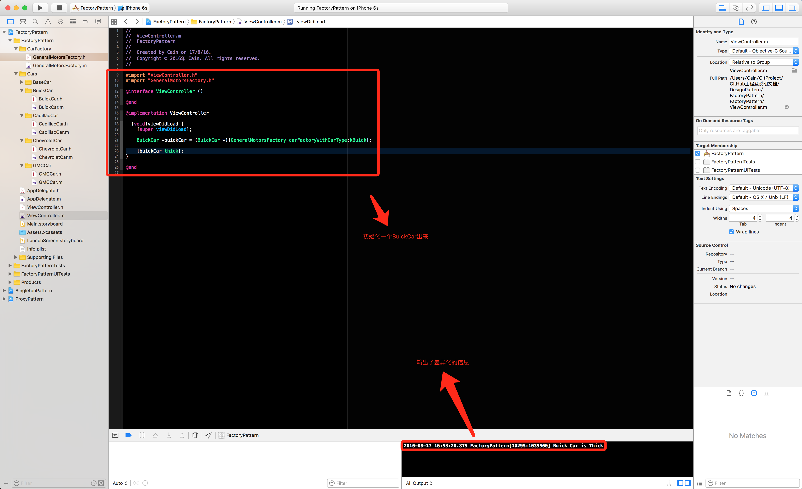

> 其他的几个品牌车子也是同理进行就可以了, 这里就不做演示了, 代码当中我会填上去, 到时候大家去下载源码下来看看就哦了~~
> 
> **`简单工厂`**到这里就基本上搞定了, 下面就让我们来看看什么是**`抽象工厂`**.

---
### 抽象工厂

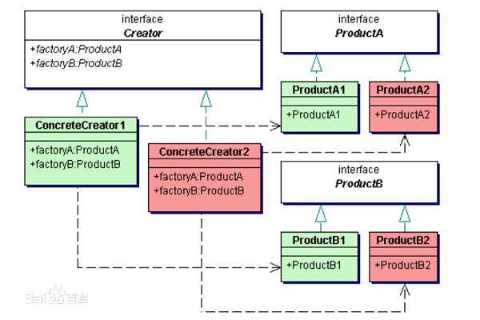

> 其实所谓的**`抽象工厂`**与**`简单工厂`**最大的却别, 就是把工厂类做成一个抽象的对象, 比**`简单工厂`**多了一层抽象层, 然后使用一个管理者去管理这些对应的厂商, 用户可以根据自己的需求, 向不同的厂商拿货, 这就像是超市似得, 一个类别的商品有好几个或者是十几个不同的厂商在供货, 可以让消费者, 根据自己的消费水平或者需求来选择不同厂商的产品, 下面让我们用代码说话~

---
### 新建抽象工厂目录

> 在开始之前, 我们肯定要先规划好文件夹的目录, 以免与之前的**`简单工厂`**类搞混, 下面就是我们的文件夹结构.

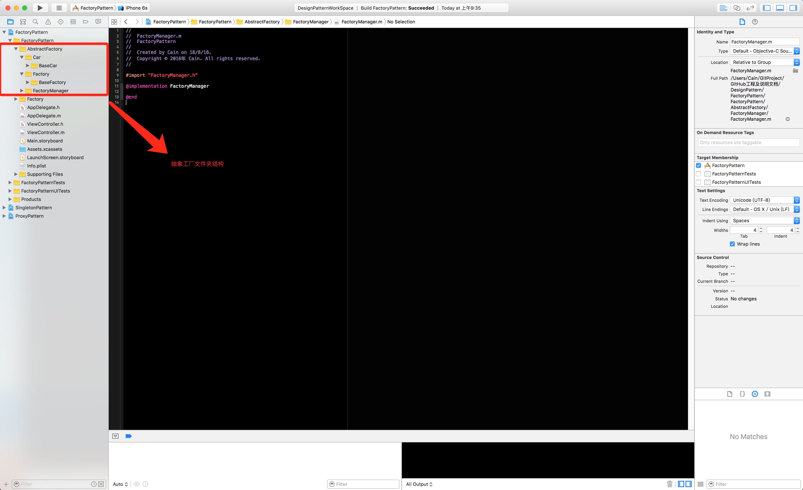

> 接下来我们就要去新建我们的**`BaseFactory`**以及**`BaseCar`**, 但是这里由于之前已经有**`BaseCar`**这个类了, 为了区别, 我们在新建的**`BaseCar`**前面加个前缀**`Ab`**, 酱紫就好了

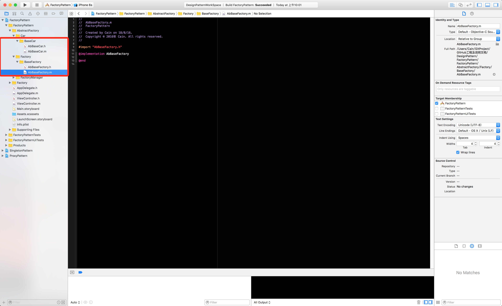

> 声明且实现**`AbBaseFactory`**的一个方法.

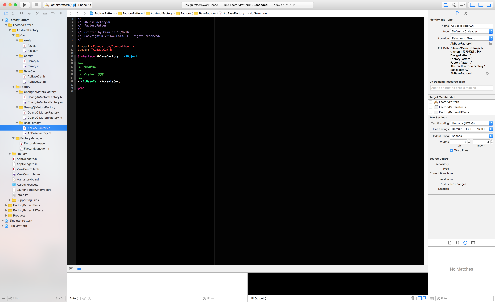
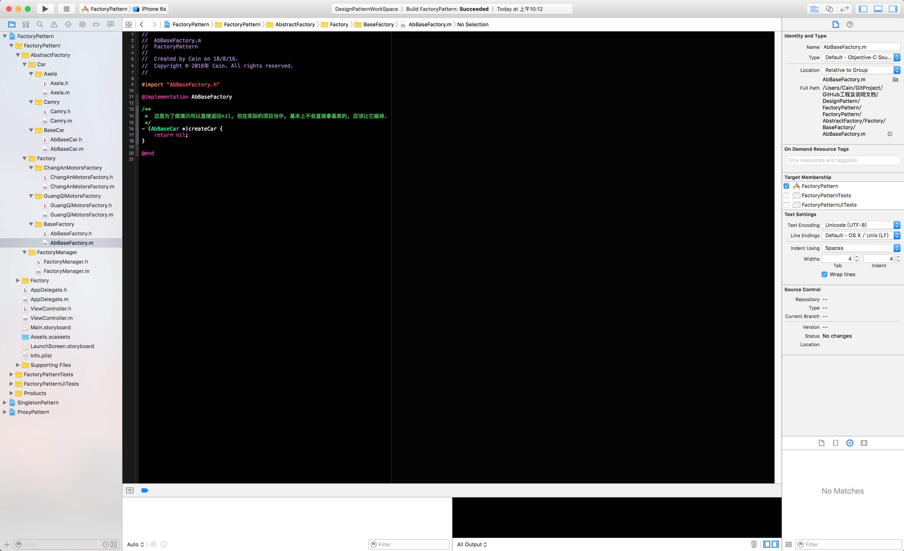

> 新建完成之后, 我们就需要继续, 这次我们拿**`长安`**和**`广汽`**两个厂商做例子, 车型的话, 我就随便挑两个, 一个是**`凯美瑞`**, 一个是**`昂克赛拉`**(我是随便取的两辆车啊, 百度一搜就出来这两个货了, 要怪就怪百度去吧).

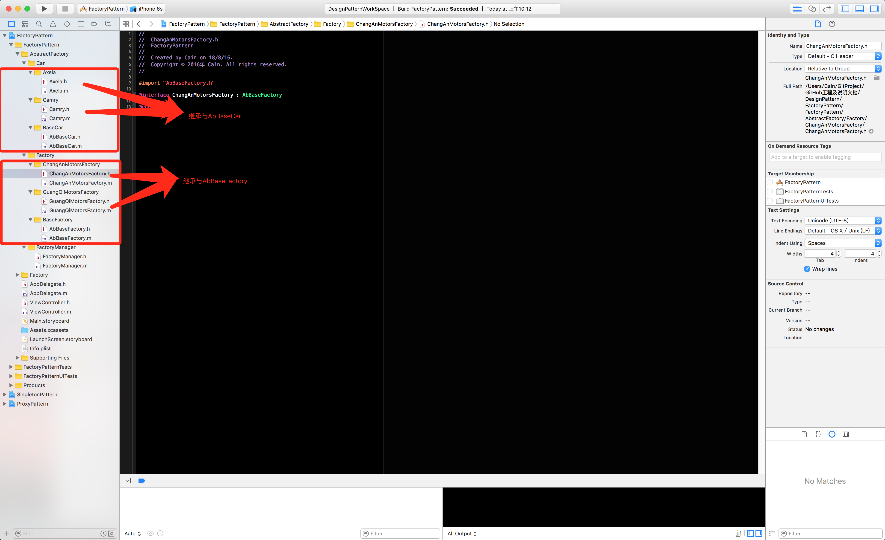

---
### 完善对应的工厂

> 新建完这些类之后, 我们需要分别给对应的厂商添加对应的车型, **`长安-马自达`**, **`广汽-凯美瑞`**

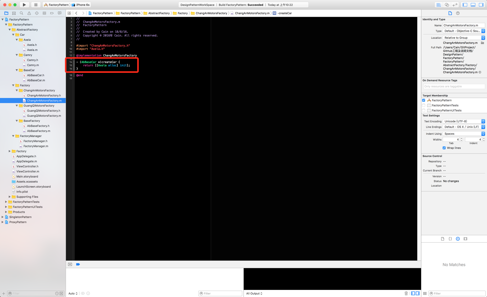

---
### 工厂管理者

> 在完成了之前的工作之后, 现在我们来看看**`抽象工厂`**的核心, 工厂管理者(FactoryManager).

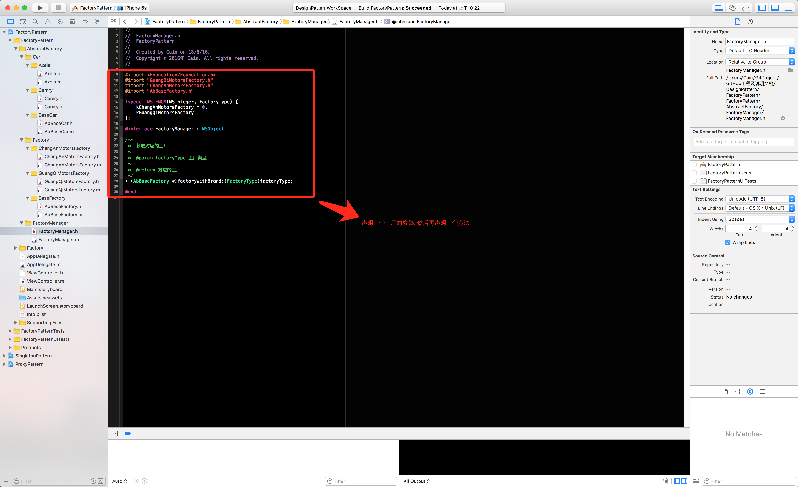
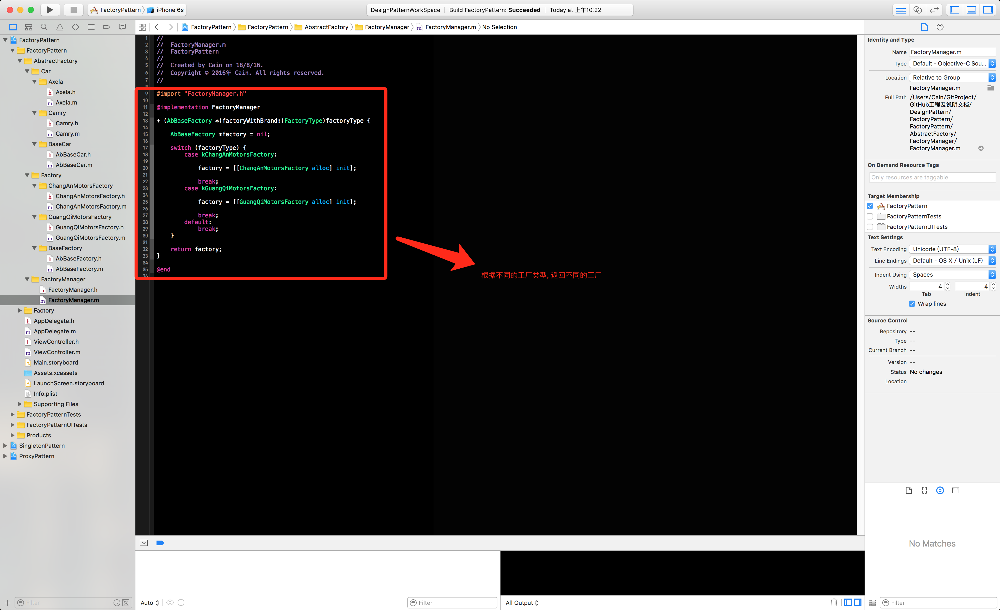

> 酱紫, 我们就完成了**`抽象工厂`**的所有步骤了, 下面让我们来使用一下**`抽象工厂`**.

---
### 使用抽象工厂

> 完成了所有步骤之后, 我们就来使用一下**`抽象工厂`**, 看看到底是不是我们所要的东西.

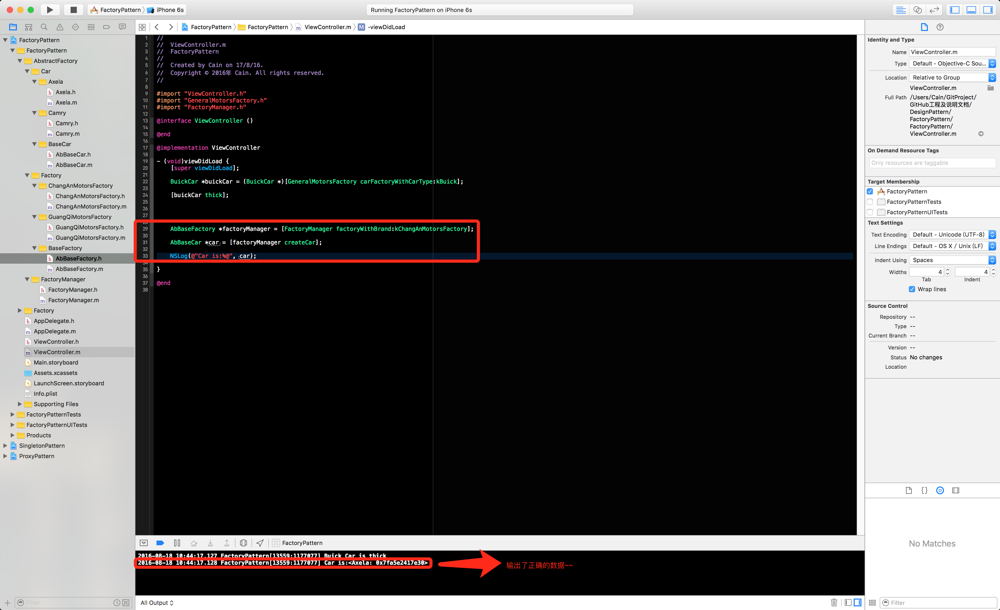

> 嘿嘿, 到这里, 我们就完成了**`工厂模式`**的**`简单工厂`**和**`抽象工厂`**了, 非常的简单, 如果你们需要对应的文档和代码, 请到我的**`GitHub`**里, 地址就在下面

---
### 工程地址

项目地址: https://github.com/CainRun/DesignPattern

项目说明: https://github.com/CainRun/DeveloperDocument

